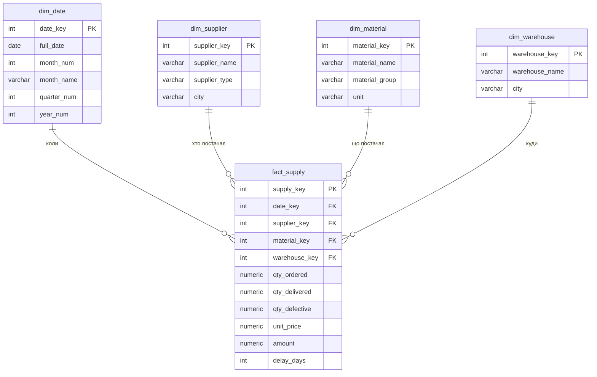

# Діаграма сховища даних

Схема «зірка»: таблиця фактів `fact_supply` і чотири виміри.

```mermaid
erDiagram
    dim_date      ||--o{ fact_supply : "коли"
    dim_supplier  ||--o{ fact_supply : "хто постачає"
    dim_material  ||--o{ fact_supply : "що постачає"
    dim_warehouse ||--o{ fact_supply : "куди"

    fact_supply {
        int supply_key PK
        int date_key FK
        int supplier_key FK
        int material_key FK
        int warehouse_key FK
        numeric qty_ordered
        numeric qty_delivered
        numeric qty_defective
        numeric unit_price
        numeric amount
        int delay_days
    }
    dim_date {
        int date_key PK
        date full_date
        int month_num
        varchar month_name
        int quarter_num
        int year_num
    }
    dim_supplier {
        int supplier_key PK
        varchar supplier_name
        varchar supplier_type
        varchar city
    }
    dim_material {
        int material_key PK
        varchar material_name
        varchar material_group
        varchar unit
    }
    dim_warehouse {
        int warehouse_key PK
        varchar warehouse_name
        varchar city
    }
```
